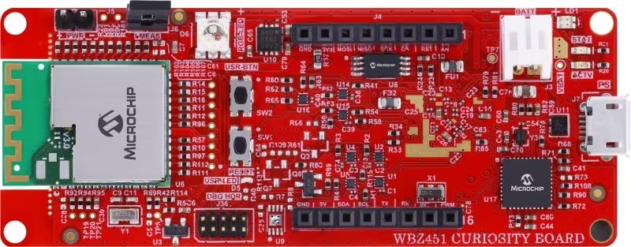
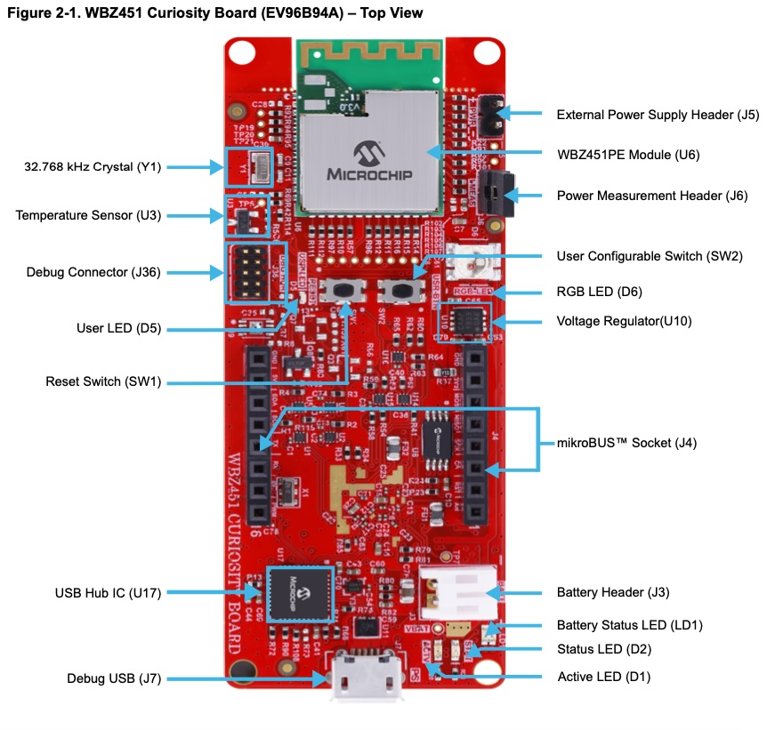
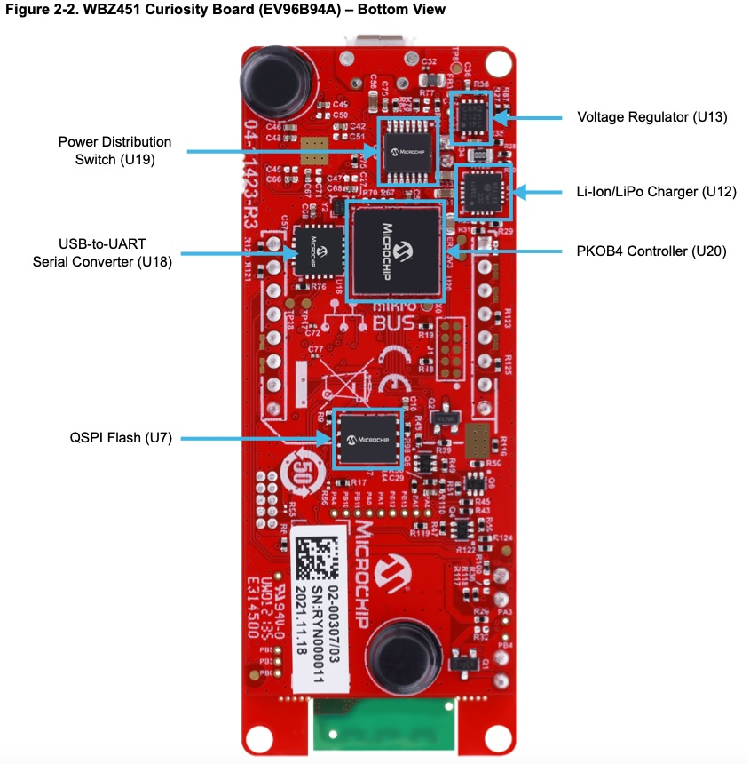
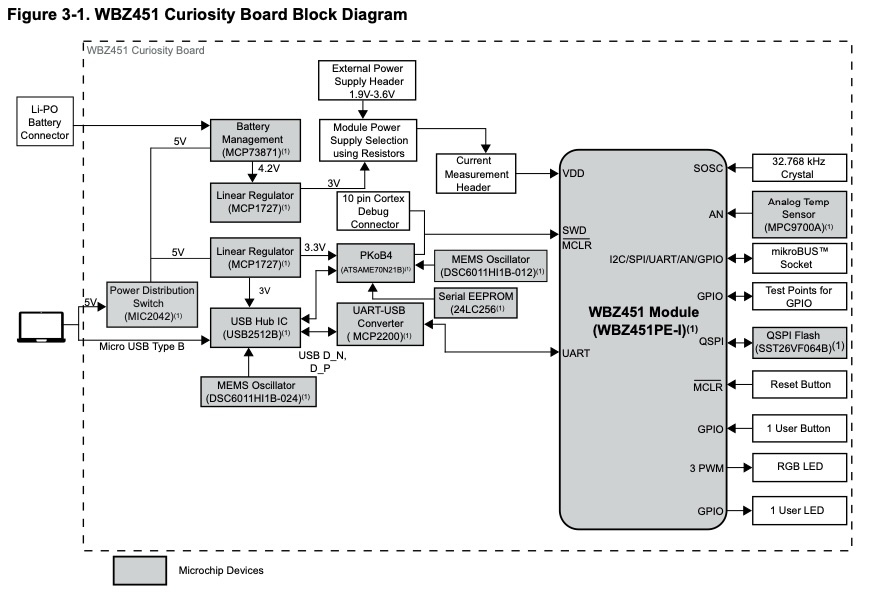

.. _pic32cxbz2_curiosity:

WBZ451 Curiosity Board Evaluation Kit
###################################

Overview
********

The WBZ451 Curiosity Board is an efficient and modular development platform
that supports rapid prototyping and demonstrates the features, capabilities
and interfaces of Microchip's Bluetooth® Low Energy and Zigbee RF Module (WBZ451PE).

The WBZ451 Curiosity Board:
• Offers integrated programming/debugging features using the PICkitTM On-board 4 (PKOB4)
  debugger interface
• Requires only a Micro USB cable to power-up and program the board
• Includes a mikroBUSTM ClickTM header, which helps the users to expand the functionalities
  by connecting to various MikroElectronika mikroBUS Click adapter boards
• Performs rapid prototyping utilizing the Bluetooth Low Energy and Zigbee-enabled RF Module

The WBZ451 Curiosity Board supports a variety of applications:
• Wireless lighting
• Home automation or Internet of Things (IoT)
• Industrial automation
• Other Bluetooth Low Energy or Zigbee-related applications

Hardware
********

- WBZ451PE Bluetooth Low Energy and Zigbee RF Module
- USB or Li-Po Battery Powered
- On-board Programmer/Debug Circuit using PKoB4 based on Microchip SAME70 MCU
- Microchip MCP73871 Li-Ion/LiPo Battery Charger with Power Path Management
- On-board USB to UART Serial Converter with Hardware Flow Control based on Microchip MCP2200
- mikroBUS Socket to Expand Functionality using MikroElectronika Click Adapter Boards
- RGB LED Connected to Pulse Width Modulation (PWM)
- One Reset Switch
- One User Configurable Switch
- One User LED
- 32.768 kHz Crystal
- Microchip SST26VF064B, 64-Mbit External QSPI Flash Memory
- Microchip MCP9700A, Low Power Analog Voltage Temperature Sensor
- 10-pin ARM Serial Wire Debug (SWD) Header for External Programmer/Debugger

Supported Features
==================

The pic32cxBZ2_cult board configuration supports the following hardware
features:

+---------------+------------+----------------------------+
| Interface     | Controller | Driver/Component           |
+===============+============+============================+
| ADC           | on-chip    | adc                        |
+---------------+------------+----------------------------+
| DAC           | on-chip    | dac                        |
+---------------+------------+----------------------------+
| DMAC          | on-chip    | dma                        |
+---------------+------------+----------------------------+
| EEPROM        | i2c        | eeprom, EUI-48 MAC Address |
+---------------+------------+----------------------------+
| EIC           | on-chip    | interrupt_controller       |
+---------------+------------+----------------------------+
| GMAC          | on-chip    | ethernet, mdio             |
+---------------+------------+----------------------------+
| GPIO          | on-chip    | gpio                       |
+---------------+------------+----------------------------+
| MPU           | on-chip    | arch/arm                   |
+---------------+------------+----------------------------+
| NVIC          | on-chip    | arch/arm                   |
+---------------+------------+----------------------------+
| NVMCTRL       | on-chip    | flash                      |
+---------------+------------+----------------------------+
| PORT          | on-chip    | pinctrl                    |
+---------------+------------+----------------------------+
| RTC           | on-chip    | timer                      |
+---------------+------------+----------------------------+
| SERCOM I2C    | on-chip    | i2c                        |
+---------------+------------+----------------------------+
| SERCOM SPI    | on-chip    | spi                        |
+---------------+------------+----------------------------+
| SERCOM USART  | on-chip    | serial, console            |
+---------------+------------+----------------------------+
| Serial Number | on-chip    | hwinfo                     |
+---------------+------------+----------------------------+
| SYSTICK       | on-chip    | timer                      |
+---------------+------------+----------------------------+
| TC            | on-chip    | counter                    |
+---------------+------------+----------------------------+
| TCC           | on-chip    | counter, pwm               |
+---------------+------------+----------------------------+
| TRNG          | on-chip    | entropy                    |
+---------------+------------+----------------------------+
| WDT           | on-chip    | watchdog                   |
+---------------+------------+----------------------------+

Other hardware features are not currently supported by Zephyr.

The default configuration can be found in the Kconfig
:zephyr_file:`boards/microchip/pic32cxbz2_curiosity/pic32cxbz2_curiosity_defconfig`.

Pin Mapping
===========

The Microchip PIC32CXBZ2 Curiosity Ultra evaluation kit has 4 GPIO controllers. These
controllers are responsible for pin muxing, input/output, pull-up, etc.

For more details please refer to `Microchip PIC32CX BZ2/SG60/SG61 Family Datasheet`_ and 
the `Microchip PIC32CXBZ2 Curiosity Ultra Schematic`_.

Default Zephyr Peripheral Mapping:
----------------------------------
- SERCOM2 USART TX : PB13
- SERCOM2 USART RX : PB12
- GPIO/PWM LED1    : PC21
- GPIO/PWM LED2    : PA16
- GPIO SW1         : PD00
- GPIO SW2         : PD01
- SERCOM0 SPI SCK  : PB24
- SERCOM0 SPI MOSI : PB25
- SERCOM0 SPI MISO : PC25	
- SERCOM0 SPI SS   : PC24

System Clock
============

The PIC32CXBZ2 MCU is configured to use the 32.768 kHz external oscillator
with the on-chip PLL generating the 48 MHz system clock.

Serial Port
===========

The PIC32CXBZ2 MCU has 8 SERCOM based USARTs with one configured as USARTs in
this BSP. SERCOM4 is the default Zephyr console.

- SERCOM4 115200 8n1 connected to the onboard Atmel Embedded Debugger (EDBG)

PWM
===

The PIC32CXBZ2 MCU has 5 TCC based PWM units with up to 6 outputs each and a period
of 24 bits or 16 bits.  If :code:`CONFIG_PWM_PIC32CXSG_TCC` is enabled then LED0 is
driven by TCC0 instead of by GPIO.

SPI Port
========

The PIC32CXBZ2 MCU has 8 SERCOM based SPIs.

I2C Port
========

The PIC32CXBZ2 MCU has 8 SERCOM based I2Cs. On the Microchip PIC32CXBZ2 Curiosity Ultra,
SERCOM7 is connected to a AT24MAC402 EEPROM.

Programming and Debugging
*************************

The Microchip WBZ451 Curiosity Board comes with On-board Programmer/Debug Circuit using PKoB4
based on Microchip SAME70 MCU.  
This provides a debug interface to the PIC32CXBZ2 chip and is supported by OpenOCD.

Flashing
========

#. Build the Zephyr kernel and the ``hello_world`` sample application:

   .. zephyr-app-commands::
      :zephyr-app: samples/hello_world
      :board: pic32cxbz2_curiosity
      :goals: build
      :compact:

#. Connect the Microchip WBZ451 Curiosity Board to your host computer using the USB debug
   port.

#. Run your favorite terminal program to listen for output. Under Linux the
   terminal should be :code:`/dev/ttyACM0`. For example:

   .. code-block:: console

      $ minicom -D /dev/ttyACM0 -o

   The -o option tells minicom not to send the modem initialization
   string. Connection should be configured as follows:

   - Speed: 115200
   - Data: 8 bits
   - Parity: None
   - Stop bits: 1

#. To flash an image:

   .. zephyr-app-commands::
      :zephyr-app: samples/hello_world
      :board: pic32cxbz2_curiosity
      :goals: flash
      :compact:

   You should see "Hello World! pic32cxbz2_curiosity" in your terminal.

References
**********

.. target-notes::

.. _Microchip website:
   https://www.microchip.com/en-us/development-tool/ev96b94a
    
.. _PIC32CX-BZ2 and WBZ45 Family Datasheet:
	https://ww1.microchip.com/downloads/aemDocuments/documents/WSG/ProductDocuments/DataSheets/PIC32CX-BZ2-and-WBZ45-Family-Data-Sheet-DS70005504.pdf